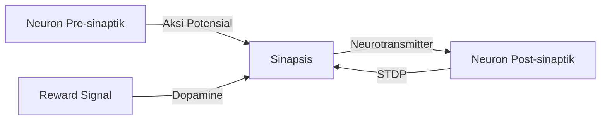
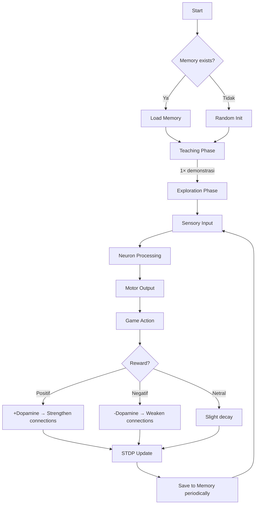

# 🧠 NeuroSim: Biological Brain Simulation Experiment

Simulasi neuron biologis yang belajar bermain game melalui "learning by doing" — bukan machine learning tradisional, melainkan proses biologis nyata di mana neuron berinteraksi, membentuk koneksi, dan belajar dari pengalaman.

## User Review Required

> [!IMPORTANT]
> **Teknologi**: Proyek ini akan dibuat sebagai web app interaktif (HTML/CSS/JavaScript) agar aktivitas neuron dapat divisualisasikan secara real-time. Apakah Anda setuju, atau lebih prefer teknologi lain (C/Python)?

> [!IMPORTANT]  
> **Game Type**: Saya mengusulkan game grid-based **"Survival Maze"** di mana neural network harus menavigasi agen untuk mencapai makanan sambil menghindari bahaya. Game ini cukup sederhana untuk dipelajari neuron tapi cukup kompleks untuk menunjukkan proses learning biologis. Apakah Anda punya preferensi game lain?

---

## Arsitektur Biologis

### 1. Model Neuron (Biologically Realistic)

Setiap neuron virtual memiliki properti biologis:

| Properti | Deskripsi | Nilai Default |
|---|---|---|
| `membranePotential` | Tegangan membran sel (-70mV resting) | -70 mV |
| `threshold` | Ambang batas untuk firing | -55 mV |
| `refractoryPeriod` | Waktu istirahat setelah firing | 2-5 ms |
| `neurotransmitterLevel` | Level neurotransmitter yang tersedia | 0.0 - 1.0 |
| `receptorSensitivity` | Kepekaan reseptor terhadap input | 0.0 - 1.0 |
| `plasticity` | Kemampuan mengubah kekuatan sinaptik | 0.0 - 1.0 |
| `fatigue` | Tingkat kelelahan neuron | 0.0 - 1.0 |

### 2. Tipe Neuron

```
┌─────────────────────────────────────────────────────┐
│                   NEURAL NETWORK                     │
│                                                      │
│  [Sensory Layer]  →  [Processing Layer]  →  [Motor]  │
│                                                      │
│  • Input Neurons     • Interneurons        • Output  │
│    (5 sensor)         (20 hidden)           (4 aksi) │
│    - Lihat makanan    - Asosiasi            - Atas    │
│    - Lihat bahaya     - Memory              - Bawah   │
│    - Jarak dinding    - Decision            - Kiri    │
│    - Posisi relatif                         - Kanan   │
│                                                      │
│  [Reward Neuron] ← Dopamine-like modulation          │
└─────────────────────────────────────────────────────┘
```

- **Sensory Neurons (5)**: Menerima input dari lingkungan game
- **Interneurons (20)**: Memproses informasi, membentuk memori asosiasi
- **Motor Neurons (4)**: Menghasilkan aksi (atas/bawah/kiri/kanan)
- **Reward Neuron (1)**: Memodulasi plastisitas berdasarkan reward/punishment

### 3. Mekanisme Sinaptik



Setiap koneksi sinaptik memiliki:
- **Weight** (kekuatan koneksi): 0.0 - 1.0
- **Delay** (jarak transmisi): 1-5 timesteps
- **Type**: Excitatory (+) atau Inhibitory (-)

### 4. Mekanisme Learning: Spike-Timing Dependent Plasticity (STDP)

Ini adalah mekanisme learning biologis yang NYATA:

```
Jika neuron A fire SEBELUM neuron B → Perkuat koneksi (A mungkin menyebabkan B)
Jika neuron A fire SETELAH neuron B  → Perlemah koneksi (A tidak menyebabkan B)

Δw = {
  +A_plus × exp(-Δt/τ_plus)    jika Δt > 0 (pre sebelum post)
  -A_minus × exp(+Δt/τ_minus)  jika Δt < 0 (post sebelum pre)
}
```

Ditambah **reward modulation**: perubahan weight dikalikan dengan sinyal dopamine saat ada reward/punishment. Ini memungkinkan neuron belajar HANYA dari pengalaman, bukan dari data training.

---

## The Game: Survival Maze

### Konsep
- Grid 10×10 dengan agen (dikendalikan neural network), makanan (reward), dan bahaya (punishment)
- Agen mendapat sensor: jarak ke makanan, arah makanan, ada bahaya di sekitar, jarak ke dinding
- **Teaching phase**: Agen ditunjukkan 1× bagaimana bergerak ke makanan (forced movement)
- **Exploration phase**: Neuron mengambil keputusan sendiri berdasarkan aktivitas internal

### Sensor Input (5 input neurons)
1. **Jarak ke makanan** (normalized 0-1)
2. **Sudut ke makanan** (normalized -1 to 1, kiri/kanan)
3. **Ada bahaya di atas/bawah** (0 atau 1)
4. **Ada bahaya di kiri/kanan** (0 atau 1)
5. **Jarak ke dinding terdekat** (normalized 0-1)

### Reward System (Dopamine-Like)
- Mendekati makanan: +0.3 dopamine
- Mendapat makanan: +1.0 dopamine (burst)
- Menabrak bahaya: -0.8 dopamine (punishment)
- Menabrak dinding berulang: -0.2 dopamine
- Idle/tidak bergerak: -0.1 dopamine

---

## Proposed Changes

### File Structure

```
neural-learn/
├── index.html          [NEW] - Entry point & game canvas
├── css/
│   └── style.css       [NEW] - Visual design & neuron visualization styles
├── js/
│   ├── neuron.js       [NEW] - Biological neuron model (core)
│   ├── synapse.js      [NEW] - Synaptic connection & STDP
│   ├── brain.js        [NEW] - Neural network assembly & orchestration
│   ├── game.js         [NEW] - Survival Maze game logic
│   ├── memory.js       [NEW] - Memory persistence (read/write memory.json)
│   ├── visualizer.js   [NEW] - Real-time neuron activity visualization
│   └── main.js         [NEW] - Application entry, game loop, coordination
└── memory.json         [NEW] - Persistent memory storage
```

---

### Core Components

#### [NEW] `js/neuron.js` - Model Neuron Biologis
- Class `Neuron` dengan semua properti biologis (membrane potential, threshold, refractory period, dll)
- Method `receiveStimulusI(input)` - menerima sinyal dari neuron lain
- Method `update(dt)` - update membrane potential berdasarkan Leaky Integrate-and-Fire model
- Method `fire()` - ketika threshold tercapai, kirim aksi potensial ke semua koneksi
- Simulasi neurotransmitter depletion & recovery
- Fatigue mechanism (neuron yang terlalu sering fire menjadi kurang responsif)

#### [NEW] `js/synapse.js` - Model Sinapsis & STDP
- Class `Synapse` dengan weight, delay, type (excitatory/inhibitory)
- Method `transmit(signal)` - transmisi sinyal dengan delay
- Method `applySTDP(preSpikeTime, postSpikeTime)` - update weight berdasarkan timing
- Method `modulateByReward(dopamineLevel)` - reward-modulated plasticity  
- Weight decay (synaptic connections yang tidak digunakan melemah perlahan)

#### [NEW] `js/brain.js` - Otak Virtual
- Membuat dan menghubungkan semua neuron
- Mengelola tick/timestep simulasi
- Menerima sensory input → distribute ke input neurons
- Membaca output dari motor neurons → tentukan aksi
- Menghitung reward signal dan mendistribusikan dopamine
- Method `teach(demonstration)` - fase teaching (1× saja)
- Method `think(sensorData)` - fase exploration (autonomous)

#### [NEW] `js/game.js` - Survival Maze
- Grid 10×10 dengan rendering visual
- Spawn makanan dan bahaya secara random
- Track skor, waktu survive, dan statistik
- Teaching mode: panduan 1× untuk tunjukkan mekanisme game
- Exploration mode: neural network mengontrol agen

#### [NEW] `js/memory.js` - Memory Persistence
- Save synaptic weights ke `memory.json` 
- Load previous memory saat startup
- Track learning history dan performance metrics
- Memory consolidation (perkuat memori yang sering digunakan)

#### [NEW] `js/visualizer.js` - Visualisasi Real-Time
- Canvas-based rendering neuron activity
- Warna neuron berubah saat firing (resting → active)
- Garis koneksi sinaptik dengan ketebalan = weight
- Graph dopamine level & performance over time
- Panel informasi neuron (klik untuk detail)

#### [NEW] `js/main.js` - Application Controller
- Initialize brain, game, visualizer
- Game loop coordination
- Speed controls (slow-mo untuk observasi, fast-forward untuk training)
- UI controls (reset, save memory, load memory)

#### [NEW] `index.html` - Main Page
- Canvas untuk game area
- Canvas/SVG untuk neuron visualization
- Dashboard panel (stats, controls, neuron info)
- Responsive layout dengan split view (game | brain visualization)

#### [NEW] `css/style.css` - Premium Visual Design
- Dark mode glassmorphism design
- Neuron glow effects saat firing
- Smooth animations dan transitions
- Gradient backgrounds yang menunjukkan brain activity level

#### [NEW] `memory.json` - Persistent Memory
```json
{
  "version": 1,
  "generations": 0,
  "totalExperience": 0,
  "bestScore": 0,
  "synapses": [
    {
      "from": "sensor_0",
      "to": "inter_3", 
      "weight": 0.45,
      "type": "excitatory"
    }
  ],
  "learningHistory": [],
  "neuronStates": {}
}
```

---

## Alur Simulasi



## Apa yang Membuat Ini Berbeda dari ML Tradisional

| Aspek | Machine Learning | NeuroSim (Biologis) |
|---|---|---|
| Learning | Backpropagation | STDP + Reward Modulation |
| Data | Dataset besar | 1× demonstrasi + exploration |
| Neuron | Perceptron abstrak | Spiking neuron dengan biokimia |
| Training | Epoch-based | Continuous, real-time |
| Memory | Model weights | Synaptic patterns + neural states |
| Decision | Deterministic | Probabilistic (noise + threshold) |
| Fatigue | Tidak ada | Neuron bisa kelelahan |
| Speed | Instan | Delay transmisi sinaptik |

## Open Questions

> [!IMPORTANT]
> 1. **Kecepatan simulasi**: Apakah Anda ingin melihat setiap langkah neuron secara detail (slow-mo), atau lebih suka fast-forward dengan ringkasan?
> 2. **Kompleksitas game**: Maze 10×10 sudah cukup, atau ingin lebih besar/kecil?
> 3. **Jumlah neuron**: 30 neuron (5 sensor + 20 hidden + 4 motor + 1 reward) sudah memadai untuk demo. Ingin lebih banyak?

## Verification Plan

### Automated Tests
- Verifikasi neuron firing saat threshold tercapai
- Verifikasi STDP mengubah weights ke arah yang benar
- Verifikasi reward signal memodulasi plasticity
- Test game loop berjalan tanpa error

### Manual Verification
- Jalankan di browser → observasi neuron activity
- Verifikasi agen belajar mendekati makanan setelah beberapa episodeVerifikasi memory.json tersimpan dengan benar
- Bandingkan performance sebelum dan sesudah learning
